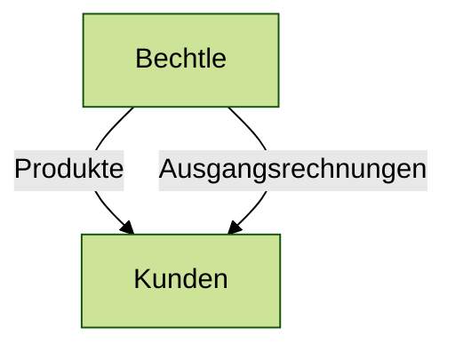
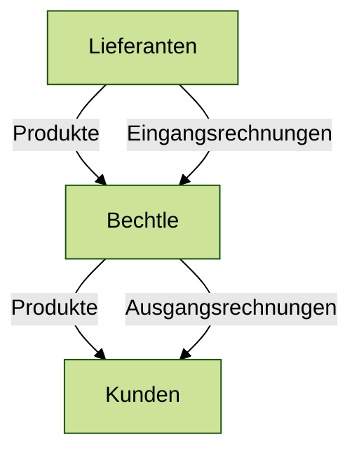
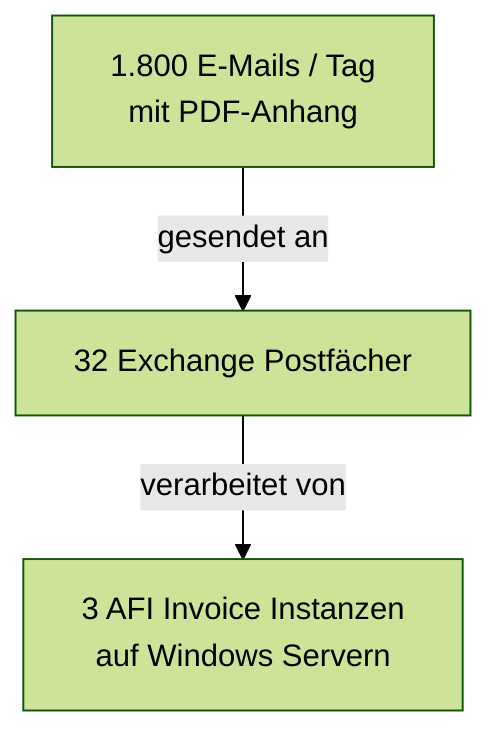

# Entwicklung einer Lösung zum Monitoring von AFI Invoice

Eine Projektarbeit von Jan Fröhlich

Neckarsulm | 26.09.2022 | Bechtle AG

<!--
- Name, Firma
- Projektarbeit Titel 
"Evaluation und prototypische Implementierung einer Lösung zum Monitoring der automatischen Rechnungsverarbeitung mittels AFI Invoice"
- Entwicklung einer Überwachungssoftware
-->

---

# Agenda

<br>

### Problemstellung
- Was ist AFI Invoice?
- Probleme mit AFI Invoice

<br>

### Vorgehen
- Ermittlung der Lösungsstrategien
- Nutzwertanalyse

<br>

### Ergebnisse
- Erkenntnisse
- Produkt

<!--
Problemstellung
- Was ist AFI Invoice
- Welche Probleme gibt es mit AFI Invoice

Vorgehen
- Finden einer Lösungsstrategie
- Entwicklung von Prototypen
- Vergleich der Lösungen mithilfe einer Nutzwertanalyse

Ergebnisse
- Erkenntnisse der Nutzwertanalyse
- Vorstellung des Produktes
-->

---
layout: image-right
image: assets/bechtle.jpg
---

# Rechnungsverarbeitung

Bechtle ist ein IT-Handelsunternehmen

<div class="absolute bottom-25">

</div>

<!--
- Bechtle ist ein IT-Handelsunternehmen
- Verkauf von Produkten an Kunden
- senden Rechnungen
-->

---
layout: image-right
image: assets/bechtle.jpg
---

# Rechnungsverarbeitung

Bechtle ist ein IT-Handelsunternehmen

<div class="absolute bottom-25">

</div>

<!--
- Bechtle bezieht Produkte von Lieferanten
→ Eingangsrechnungen
- Projektarbeit thematisiert nur Eingangsrechnungen
-->

---
layout: image-right
image: 'https://inbox-monitor.cfapps.eu20.hana.ondemand.com/'
---

# Rechnungsverarbeitung

AFI Invoice verarbeitet Eingangsrechnungen

<br>



---
layout: two-cols
---
# Rechnungsverarbeitung

Funktionsweise von AFI Invoice

<br>

<Inbox name="Posteingang - Bechtle Deutschland" />

::right::
<div class="w-full h-full pl-12 flex flex-col gap-8">
  <Invoice />
  <Sap />
</div>

---
layout: iframe
url: 'https://inbox-monitor.cfapps.eu20.hana.ondemand.com/'
---

# Rechnungsverarbeitung

Funktionsweise von AFI Invoice

<br>
<br>

<Inbox>

</Inbox>

---

# Navigation

Hover on the bottom-left corner to see the navigation's controls panel

### Keyboard Shortcuts

|     |     |
| --- | --- |
| <kbd>space</kbd> / <kbd>tab</kbd> / <kbd>right</kbd> | next animation or slide |
| <kbd>left</kbd>  / <kbd>shift</kbd><kbd>space</kbd> | previous animation or slide |
| <kbd>up</kbd> | previous slide |
| <kbd>down</kbd> | next slide |

---
layout: image-right
image: 'https://source.unsplash.com/collection/94734566/1920x1080'
---

# Code

Use code snippets and get the highlighting directly!

```ts
interface User {
  id: number
  firstName: string
  lastName: string
  role: string
}

function updateUser(id: number, update: Partial<User>) {
  const user = getUser(id)
  const newUser = { ...user, ...update }
  saveUser(id, newUser)
}
```

---
layout: center
class: "text-center"
---

# Learn More

[Documentations](https://sli.dev) / [GitHub Repo](https://github.com/slidevjs/slidev)
