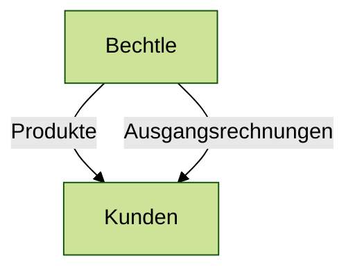
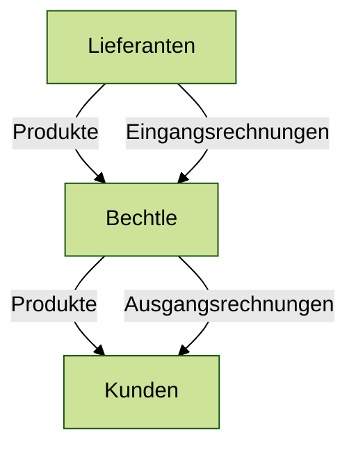

# Entwicklung einer Lösung zum Monitoring von AFI Invoice

Eine Projektarbeit von Jan Fröhlich

Mosbach | 28.09.2022 | Bechtle AG

<!--
- Name, Firma
- Projektarbeit Titel 
"Evaluation und prototypische Implementierung einer Lösung zum Monitoring der automatischen Rechnungsverarbeitung mittels AFI Invoice"
- Entwicklung einer Überwachungssoftware

,,

- einige mit AFI Invoice vertraut, Ergebnis gesehen
- Fragen stellen, später mitmachen
-->

---
layout: image-right-bottom
image: /assets/Textur_Fliesen_rosa-gelb.jpg
---

# Agenda

 

### Problemstellung
- Was ist AFI Invoice?
- Probleme mit AFI Invoice

 

### Vorgehen
- Lösungsstrategie
- Nutzwertanalyse

 

### Ergebnisse
- Erkenntnisse
- Vorstellung der Anwendung

<!--
Problemstellung
- Was ist AFI Invoice
- Welche Probleme

Vorgehen
- Finden einer Lösungsstrategie
- Entwicklung von Prototypen
- Vergleich der Lösungen mithilfe einer Nutzwertanalyse

Ergebnisse
- Erkenntnisse der Nutzwertanalyse
- Vorstellung des Produktes
-->

---
layout: image-right
image: /assets/170531_nhm_bec_3326.jpg
---

# Rechnungsverarbeitung

Bechtle ist ein IT-Handelsunternehmen

---
layout: image-right
image: /assets/170531_nhm_bec_3326.jpg
---

# Rechnungsverarbeitung

Bechtle ist ein IT-Handelsunternehmen

<!--
- empfangen, überprüfen, um fristgerecht bezahlen
- Rechnungen werden in Form einer PDF-Datei ausgestellt
- 32 E-Mail-Postfächer, um diese als Anhang einer E-Mail zu empfangen
- Software zur Verarbeitung
-->

---
layout: two-cols
---

# Rechnungsverarbeitung

Funktionsweise von AFI Invoice

 

<Inbox name="Posteingang - Bechtle Deutschland" mt-1 />

::right::

  <Invoice />
  <Sap />

<!--
- beschreiben: E-Mail mit PDF
- PDF → übertragen
- SAP, Bestellung getätigt, Rechnungsnummer
-->

---
layout: image-right
image: /assets/170530_nhm_bec_1932.jpg
---

# Lösungsstrategien

zur Erkennung der Ausfälle

 

- manuelle Überprüfung
- Lösung der Probleme
- Monitoring von AFI Invoice

<!--
zeitintensiv / nicht so verlässlich wie automatische Lösung

#### AFI Solutions
- Problem bestätigt
- mögliche Ursachen genannt
- Maßnahmen zur Vermeidung des Problems
- Problem kann nicht gänzlich ausgeschlossen werden

#### Monitoring
- mehrere Ansätze verglichen
- Abfrage über Schnittstelle
- ← Graph API
- praktische Anwendung zeigt Eignung

,,

(falsch codierte, zu große E-Mails, Java-Crashes, Windows Updates → Wartungsvertrag / proaktives Monitoring)
-->

---
layout: image-right
image: /assets/technologies.png
---

# Konzeption

 

#### Komponentent der Anwendung

- Datenquelle
- Benachrichtigungssytem
- Benutzeroberfläche

 

#### Nutzwertanalyse

- Nuxt.js 3
- Microsoft Power Automate

<!--
-
-->

---
layout: iframe
url: 'https://inbox-monitor-test.cfapps.eu20.hana.ondemand.com/'
scale: 0.82
---

---
layout: image-right
image: /assets/170531_nhm_bec_3609.jpg
---

# Rechnungsverarbeitung

AFI Invoice verarbeitet Eingangsrechnungen

 

<!--
- Deutschland, Österreich/Schweiz, Europa
-->

---

<Navigation />
